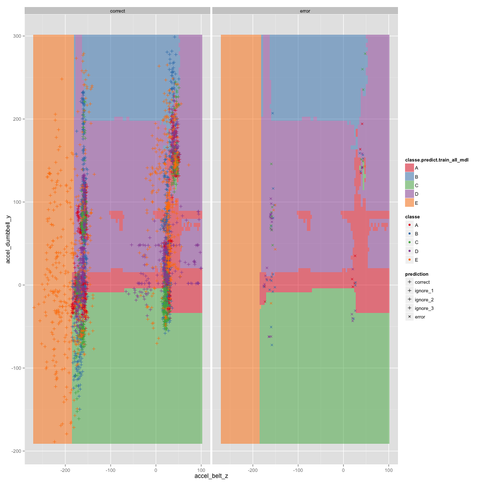
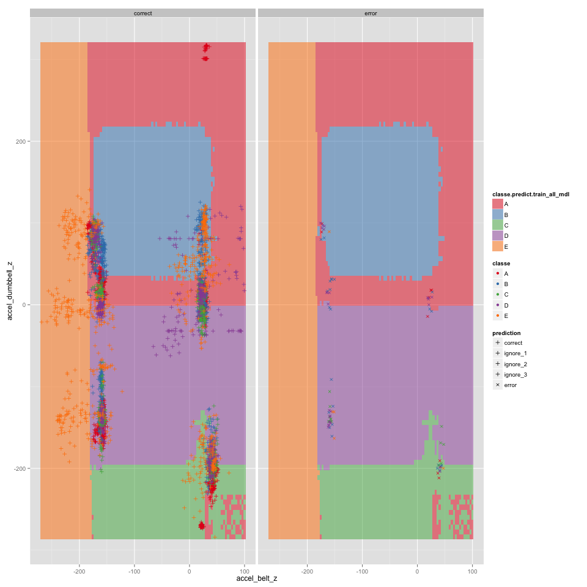
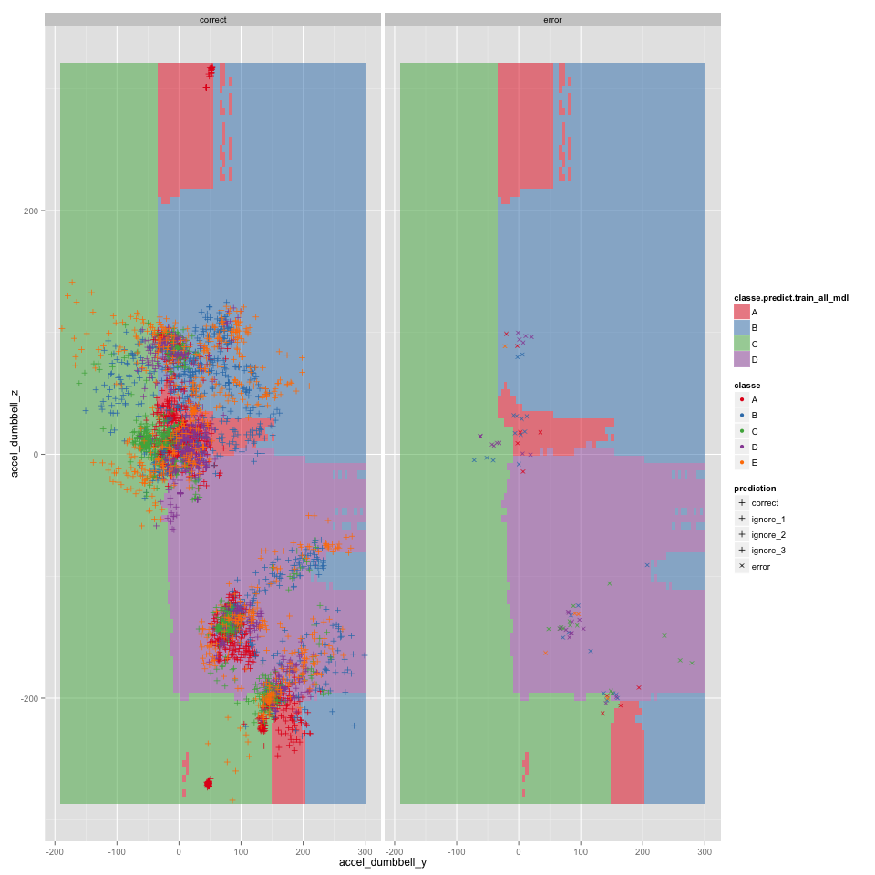

#### Date: `r format(Sys.time(), "(%a) %b %d, %Y")`

Data: Measurement of exercises performed by six male participants aged between 20-28 years, with little weight lifting experience using a light dumbbell (1.25kg)  
Source: http://groupware.les.inf.puc-rio.br/har  
Time period: Nov - Dec 2011 (based on cvtd_timestamp values in data)

```{r set_global_options_wd, echo=FALSE}
setwd("~/Documents/Work/Courses/Coursera/jhu-datascience/H-Practical-Machine-Learning/Project/HAR-WLE")
```

### Synopsis:

#### Model Summary: Random Forests:

Classification results on test data (3,923 obs - 20% of training data) utilizing top 3 important features:  
Note: could not figure out how to make ggplot2 think there are only 2 possible values for "prediction" - it has to be number (not a factor) because scale_shape_identity() is being used & it is highly probable that ggplot2 wants to make the length of each legend similar ?





#### How you built your model:
1. Selected Random Forests (rf) since this is a multi-class classification problem & the associated research paper indicated that the original data collectors also utilized this algorithm.

2. Optimized fitting the model (first run on training data took a long time & did not complete):  
    2.1 Partitioned training data into training (64%), validation (16%) & testing (20%) data 
    2.2 Selected subset of training data - both rows & columns to fit "base" model within 30 elapsed seconds  
    2.3 Identified "base" model parameters such as pre-processing type, sampling method, number of resamples, mtry (rf tuning parameter) etc.  
    2.4 Generated a model parameter grid to vary parameters from the "base" model specifications  
    2.5 Fit one model for each row in the model parameter grid & collected elapsed time and prediction accuracy on the validation data set.  
    2.6 Optimized trade-off between elapsed time & validation data prediction accuracy to fit the "tuned" model within 60 elapsed seconds. This turned out to include only half the potential features and 20% of training data   
    
3. Enhanced model to fit all training (incl. validation) data & tested prediction accuracy on testing data

4. Enhanced model to fit all training (incl. validation & testing) data & generated predictions on new data

#### How you used cross validation:
1. Utilized caret's in-built sampling methods to select observations and features for each tree in the random forest

2. Sampled observations to optimize model fitting elapsed time vs. validation data prediction accuracy

#### What you think the expected out of sample error is:
Very low (compared to other machine learning exercises) since the random forests generated near-zero prediction mistakes on the validation data set. Prediction accuracy on testing data was `0.9796`. Therefore, for `100` new observations the model is expected to make atmost ``r round((1 - 0.9796) * 100.0, 0)`` errors. 

#### Why you made the choices you did:
Explained classification algorithm selection earlier. Most of the effort went into optimizing the trade-offs between fitting time and prediction accuracy.

#### Use your prediction model to predict 20 different test cases:
Brief summary of the prediciton results on new data:

    X   user_name                classe.predict.entity_all_mdl  
*   1       pedro                             B  
*   2    jeremy                             A  
*   3    jeremy                             C  
*   4    adelmo                             A  
*   5    eurico                             A  
*   6    jeremy                             E  
*   7    jeremy                             D  
*   8    jeremy                             B  
*   9  carlitos                             A  
* 10   charles                             A  
* 11  carlitos                             B  
* 12    jeremy                             C  
* 13    eurico                             B  
* 14    jeremy                             A  
* 15    jeremy                             E  
* 16    eurico                             E  
* 17     pedro                             A  
* 18  carlitos                             B  
* 19     pedro                             B  
* 20    eurico                             B  

#### Potential next steps include:

-1. Feature distribution checks
0. Add piece-wise glm logistic regression
1. Dummy Classifer
2. Compress analysis report (please feel free to stop here if you feel that the entire report is too detailed)
3. Peform PCA pre-processing and select "key" features to make the model more interpretable 
4. Evaluate other classification algorithms (e.g. SVMs, kNN, etc.) 

### Analysis: 
```{r set_global_options}
rm(list=ls())
set.seed(12345)
source("~/Dropbox/datascience/R/mydsutils.R")
source("~/Dropbox/datascience/R/myplot.R")
# Gather all package requirements here
suppressPackageStartupMessages(require(caret))
suppressPackageStartupMessages(require(plyr))
suppressPackageStartupMessages(require(reshape2))
suppressPackageStartupMessages(require(RColorBrewer))

script_df <- data.frame(chunk_label="import_data", chunk_step_major=1, chunk_step_minor=0)
```

#### Step ``r script_df[nrow(script_df), "chunk_step_major"]``: import data
```{r import_data, cache=TRUE}
entity_df <- myimport_data(
    "https://d396qusza40orc.cloudfront.net/predmachlearn/pml-training.csv", 
    print_diagn=FALSE)
predict_df <- myimport_data(
    "https://d396qusza40orc.cloudfront.net/predmachlearn/pml-testing.csv", 
    print_diagn=FALSE)

script_df <- rbind(script_df, 
                   data.frame(chunk_label="inspect_data", 
                              chunk_step_major=max(script_df$chunk_step_major)+1, chunk_step_minor=0))
```

#### Step ``r script_df[nrow(script_df), "chunk_step_major"]``: inspect data
```{r inspect_data_1, cache=TRUE}
#print(str(entity_df))
#print(str(predict_df))

# List info gathered for various columns
# X:                    int:    1:20            [record_id]
# user_name:            factor: 6 subject names

# raw_timestamp_part_1: int:                    [excluded for modeling]
# raw_timestamp_part_2: int:                    [excluded for modeling]
# cvtd_timestamp:       factor:                 [excluded for modeling]

# new_window:           factor: no; yes         [only no in predict_df]
# num_window:           int:    1:19622         

# classe:               factor: 5 categories    [response variable]
# problem_id:           int:    1:20            [only in predict_df]

#print(summary(entity_df))
#print(summary(predict_df))
id_varnames <- c("user_name", "X")
response_varname <- "classe"
```
Many columns in new data (predict_df) are missing for all records. Let's delete these columns from both training & new datasets to make the analysis faster & easier.

```{r inspect_data_2, cache=TRUE}
all_na_cols <- myfind_all_na_cols_df(predict_df)
print("deleting all na cols:")
print(all_na_cols)

predict_cln_df <- mydelete_cols_df(predict_df, all_na_cols)
#print(summary(predict_cln_df))

# get rid of the original datasets to save memory
predict_df <- predict_cln_df
entity_df <- mydelete_cols_df(entity_df, all_na_cols)
#print(summary(entity_df))

print(myplot_histogram(entity_df, "classe", fill_col_name="user_name"))
print(myplot_histogram(predict_df, "user_name", show_stats=FALSE))

script_df <- rbind(script_df, 
                   data.frame(chunk_label="select_features", 
                              chunk_step_major=max(script_df$chunk_step_major)+1, chunk_step_minor=0))                              
```

#### Step ``r script_df[nrow(script_df), "chunk_step_major"]``: select features
```{r select_features_1, cache=TRUE}
#```{r select_features_1}
features_lst <- names(predict_df)

# Remove features that are not relevant for modeling
features_lst <- features_lst[!(features_lst %in% 
                                c(id_varnames, "problem_id"))]
features_lst <- features_lst[!(features_lst %in% 
                                grep("timestamp", features_lst, value=TRUE))]

feats_df <- nearZeroVar(entity_df[, features_lst], saveMetrics=TRUE)
feats_df$feature <- rownames(feats_df)
# used later for plots
feats_df$percentUniqueCut_fctr <- cut(feats_df$percentUnique, breaks=5)
print(subset(feats_df, nzv == TRUE))
nearZeroVars <- subset(feats_df, nzv == TRUE)$feature
print(summary(entity_df[, nearZeroVars]))
print(summary(predict_df[, nearZeroVars]))

feats_df <- subset(feats_df, nzv == FALSE)
```

Let's add a random variable (my.rnorm) as a feature since some models (e.g. random forests) like a random variable & any model that categorizes this feature as significant would be suspect.

```{r select_features_2, cache=TRUE}
random_varname <- "my.rnorm"
predict_df$my.rnorm <- rnorm(nrow(predict_df))
entity_df$my.rnorm <- rnorm(nrow(entity_df))
feats_df[nrow(feats_df) + 1, "feature"] <- random_varname

# Since some steps might need to be re-run:
feats_save_df <- feats_df

script_df <- rbind(script_df, 
                   data.frame(chunk_label="partition_data", 
                              chunk_step_major=max(script_df$chunk_step_major)+1, chunk_step_minor=0))                              
```

#### Step ``r script_df[nrow(script_df), "chunk_step_major"]``: partition data
```{r partition_data, cache=TRUE}
#```{r partition_data}

mypartition_data <- function(more_stratify_vars=NULL) {
    print(" "); print(sprintf("nrow(entity_df): %s", format(nrow(entity_df), big.mark=',')))
    if (missing(more_stratify_vars)) { 
        print(table(entity_df[, response_varname])) 
        keep_cols <- response_varname
    } else {
        entity_tbl <- table(entity_df[, response_varname], 
                            entity_df[, more_stratify_vars])
        print(entity_tbl)
        keep_cols <- c(response_varname, more_stratify_vars)
    }    
    
    inTrainValidate <- createDataPartition(y=entity_df[, response_varname], 
                                           p=0.8, list=FALSE)
    train_validate_df <- entity_df[inTrainValidate, keep_cols]
    
    inTest <- setdiff(seq(1:nrow(entity_df)), inTrainValidate)
    inTest <- matrix(inTest, nrow=length(inTest), 
                     dimnames=dimnames(inTrainValidate)) 
    test_df <- entity_df[inTest, keep_cols]
    
    inTrain <- createDataPartition(y=train_validate_df[, response_varname], 
                                   p=0.8, list=FALSE)
    train_df <- train_validate_df[inTrain, keep_cols]
    
    inValidate <- setdiff(seq(1:nrow(train_validate_df)), inTrain)
    inValidate <- matrix(inValidate, nrow=length(inValidate), 
                     dimnames=dimnames(inTrain))     
    validate_df <- train_validate_df[inValidate, keep_cols]
    
    chk_nrow <- nrow(train_df) + nrow(validate_df) + nrow(test_df)
    if (nrow(entity_df) != chk_nrow)
        stop("entity_df not partitioned properly; nrow(entity_df): ", 
             format(nrow(train_df), big.mark=','),
             " nrow of train+validate+test_df:", 
             format(chk_nrow, big.mark=','))
    
    print(" "); print(sprintf("nrow(train_df): %s", format(nrow(train_df), big.mark=',')))
    print(suppressWarnings(formatC(table(train_df$classe, 
        train_df[, more_stratify_vars]) / entity_tbl, digits=3, format='f')))

    print(" "); print(sprintf("nrow(validate_df): %s", format(nrow(validate_df), big.mark=',')))
    print(suppressWarnings(formatC(table(validate_df$classe, 
        validate_df[, more_stratify_vars]) / entity_tbl, digits=3, format='f')))

    print(" "); print(sprintf("nrow(test_df): %s", format(nrow(test_df), big.mark=',')))
    print(suppressWarnings(formatC(table(test_df$classe, 
        test_df[, more_stratify_vars]) / entity_tbl, digits=3, format='f')))
    
    return(list(inTrain=inTrain, inValidate=inValidate, inTest=inTest))
}
mypartition_data_lst <- mypartition_data(more_stratify_vars="user_name")
keep_cols <- c(feats_df$feature, response_varname, id_varnames)
train_df <- entity_df[mypartition_data_lst$inTrain, keep_cols]
validate_df <- entity_df[mypartition_data_lst$inValidate, keep_cols]
test_df <- entity_df[mypartition_data_lst$inTest, keep_cols]

# all.equal(train_save_df, train_df)
# setdiff(union(names(train_save_df), names(train_df)), intersect(names(train_save_df), names(train_df)))

if (!("inspect_features" %in% script_df$chunk_label))
script_df <- rbind(script_df, 
                   data.frame(chunk_label="inspect_features", 
                              chunk_step_major=max(script_df$chunk_step_major)+1, chunk_step_minor=0))                              
```

#### Step ``r script_df[nrow(script_df), "chunk_step_major"]``: inspect features
```{r inspect_features}
# Compute feature correlations with response to prioritize feature selection for model design
feats_cor_df <- data.frame( response.cor=cor(train_df[, feats_df$feature], 
                            unclass(train_df[, response_varname])))
feats_cor_df$response.cor.abs <- abs(feats_cor_df$response.cor)
feats_cor_df$feature <- rownames(feats_cor_df)
feats_cor_df <- orderBy(~ -response.cor.abs, data=feats_cor_df)

#intersect(names(feats_df), names(feats_cor_df))
feats_df <- feats_save_df
feats_tmp_df <- merge(feats_df, feats_cor_df)
feats_tmp_df <- orderBy(~ -response.cor.abs, data=feats_tmp_df)
#print(head(feats_tmp_df))
#print(head(feats_cor_df))

feats_all_df <- feats_tmp_df

# Extract features that have higher correlation than the random variable that was inducted ('my.rnorm')
feats_df <- subset(feats_all_df, 
    response.cor.abs >= feats_all_df[which(feats_all_df$feature == random_varname),
                                    "response.cor.abs"])
feats_df <- orderBy(~ - response.cor.abs, feats_df)
myprint_df(feats_df)

# Plot subset of points since all points just creates a "waterfall" of the last color in the scale
train_plot_df <- melt(train_df[createDataPartition(y=train_df[, response_varname], p=0.1, list=FALSE),
                                c(response_varname, "user_name", feats_df$feature[1:4])],
                    measure.vars=c(feats_df$feature[2:4]))
#print(table(train_plot_df[, response_varname]))
print(ggplot(train_plot_df, aes_string(x=feats_df[1, "feature"], 
                                        y="value",
                                  color=response_varname)) + 
          geom_point(position="jitter") + scale_color_brewer(type="qual", palette="Set1") + 
          facet_wrap(~ variable, scales="free_y"))

# check feature distribution type
feats_df <- orderBy(~ - response.cor.abs, feats_df)
#feats_df[1, "shapiro.test.W"] <- shapiro.test(sample(train_df[, feats_df$feature[1]], size=5000))$statistic
feats_df$shapiro.test.W <- sapply(feats_df$feature, 
    function(feat) shapiro.test(sample(train_df[, feat], size=5000))$statistic)

feats_plot_df <- mutate(feats_df, 
                feature_label = ifelse((shapiro.test.W < 0.75), feature, ""))
print(ggplot(feats_plot_df, aes(x=response.cor, y=shapiro.test.W)) + 
          geom_point(position="jitter") + 
          geom_text(aes(label=feature_label), color="slategrey", size=3))

# check distributions in entire data (incl. test) for outliers that might be 
#   distorting the distributions
entity_plot_df <- 
    melt(entity_df[, c(id_varnames, "my.rnorm", 
                       "gyros_forearm_x", "gyros_forearm_y", "gyros_forearm_z")],
         id.vars=id_varnames)
entity_plot_df <- mutate(entity_plot_df, 
    X_label = ifelse((  ((variable == "gyros_forearm_x") & (value < -5)) | 
                        ((variable == "gyros_forearm_y") & (value >  5)) | 
                        ((variable == "gyros_forearm_z") & (value >  5))), 
                        X, ""))
entity_plot_df <- merge(entity_plot_df, 
                        feats_df[, c("feature", "response.cor")], 
                        by.x="variable", by.y="feature", all.y=FALSE)
print(ggplot(entity_plot_df, aes(x=factor(0), y=value)) + 
          geom_violin(aes(fill=response.cor)) + 
          geom_text(aes(label=X_label), color="slategrey", size=3) + 
          facet_wrap(~ variable, scales="free_y") + xlab(""))

myprint_df(feats_df)
```

```{r inspect_features_1, cache=TRUE}
print("Suspect data:")
print(entity_df[entity_df$X == 5373,])

# Make the suspect data missing & impute missing data & compare to original data
#   to verify that this might be a data entry error
entity_tmp_df <- entity_df
entity_tmp_df[entity_tmp_df$X == 5373, 
              c("gyros_forearm_x", "gyros_forearm_y", "gyros_forearm_z")] <- NA
print(entity_tmp_df[entity_tmp_df$X == 5373, ])

preProc_lst <- preProcess(entity_tmp_df[, feats_df$feature], method=c("knnImpute"), verbose=TRUE)
print(preProc_lst)
entity_preProc_std_df <- data.frame(matrix(preProc_lst$std, nrow=1, 
                                           ncol=length(preProc_lst$std), 
                                           dimnames=list("std", names(preProc_lst$std))))
print(entity_preProc_std_df)
entity_preProc_mean_df <- data.frame(matrix(preProc_lst$mean, nrow=1, 
                                           ncol=length(preProc_lst$mean), 
                                           dimnames=list("mean", names(preProc_lst$mean))))
print(entity_preProc_mean_df)

# entity_preProc_df <- data.frame(preProc_lst$data)
# all.equal(entity_preProc_df, entity_tmp_df[, feats_df$feature])
require(RANN)
entity_preProc_df <- predict(preProc_lst, entity_tmp_df[, feats_df$feature], verbose=TRUE)
entity_invProc_df <- entity_preProc_df
# entity_invProc_df[, "accel_arm_x"] <- (entity_preProc_df[, "accel_arm_x"] * 
#                                     entity_preProc_std_df[1, "accel_arm_x"]) + 
#                                     entity_preProc_mean_df[1, "accel_arm_x"]
for (feat in feats_df$feature)
    entity_invProc_df[, feat] <- (entity_preProc_df[, feat] * 
                                entity_preProc_std_df[1, feat]) + 
                                entity_preProc_mean_df[1, feat]
entity_invProc_df[, id_varnames] <- entity_df[, id_varnames]
#all.equal(entity_invProc_df[, "accel_arm_x"], entity_tmp_df[, "accel_arm_x"])
print(all.equal(entity_invProc_df[, feats_df$feature], 
          entity_tmp_df[, feats_df$feature]))

print(entity_df[entity_df$X == 5373, 
                    c("gyros_forearm_x", "gyros_forearm_y", "gyros_forearm_z")])
print(entity_tmp_df[entity_tmp_df$X == 5373, 
                    c("gyros_forearm_x", "gyros_forearm_y", "gyros_forearm_z")])
print(entity_invProc_df[entity_invProc_df$X == 5373, 
                    c("gyros_forearm_x", "gyros_forearm_y", "gyros_forearm_z")])

```

It appears that this observation has some data entry errors. Since it's just 1 observation, let's delete this. If there were more occurences of these errors, we can then consider including the imputed data.

```{r inspect_features_n_minus_1, cache=TRUE}
print(sprintf("Rows before deletion: %s", format(nrow(entity_df), big.mark=',')))
entity_df <- entity_df[entity_df$X != 5373, ]
print(sprintf("Rows after  deletion: %s", format(nrow(entity_df), big.mark=',')))
```

Now, we need to re-run a whole bunch of stuff. 

#### Step ``r script_df[script_df$chunk_label == "partition_data", "chunk_step_major"]``: partition data: run 2
```{r partition_data_run_2, cache=TRUE}
mypartition_data_lst <- mypartition_data(more_stratify_vars="user_name")
keep_cols <- c(feats_df$feature, response_varname, id_varnames)
train_df <- entity_df[mypartition_data_lst$inTrain, keep_cols]
validate_df <- entity_df[mypartition_data_lst$inValidate, keep_cols]
test_df <- entity_df[mypartition_data_lst$inTest, keep_cols]
```
#### Step ``r script_df[script_df$chunk_label == "inspect_features", "chunk_step_major"]``: inspect features: run 2
```{r inspect_features}
```

```{r inspect_features_n, cache=TRUE}
script_df <- rbind(script_df, 
                   data.frame(chunk_label="design_models", 
                              chunk_step_major=max(script_df$chunk_step_major)+1, chunk_step_minor=0))                              
```

#### Step ``r script_df[nrow(script_df), "chunk_step_major"]``: design models
```{r design_models_1, cache=TRUE}

# Create a function to fit a model based on different tuning parameters which will be used to optimize fit elapsed time vs. validation data prediction accuracy
mytrain_model <- function(par_row, fit_df=train_df) {
    #print(sprintf("num_feats: %d", num_feats))
    #print(sprintf("p_obs: %f", par_row$p_obs))
    
    # Because of random forests, let's try to make each fit run as similar as possible
    set.seed(12345)
    
    mdl_frmla <- reformulate(feats_df$feature[1:par_row$num_feats], response_varname)
    train_sst_df <- fit_df[createDataPartition(y=fit_df[, response_varname], 
                                                 p=par_row$p_obs, list=FALSE), 
                             c(response_varname, feats_df$feature[1:par_row$num_feats])]
    ctrl <- trainControl(method=par_row$sampling_method
                        , number=par_row$n_resample
                        #, repeats=repeats
                        #, seeds = seeds
                        )
    
    # mtry is a tuning parameter for random forests
    if (par_row$mtry > -1) tune_grid <- expand.grid(mtry=par_row$mtry)
    else tune_grid <- NULL;
    
    mdl <- train(mdl_frmla, data=train_sst_df, 
                preProcess=eval(parse(text=par_row$preProcess)),
                method="rf", tuneGrid=tune_grid
                , trControl = ctrl
                )
    #print(mdl)
    #print(varImp(mdl))
    
    # collect fitting results data
    df <- data.frame(
                    num_feats=par_row$num_feats,
                    p_obs=par_row$p_obs,
                    preProcess=par_row$preProcess,
                    sampling_method=par_row$sampling_method,
                    n_resample=nrow(mdl$resample),
                    mtry=mdl$results[nrow(mdl$results), "mtry"],
                    accuracy_train=mdl$results[nrow(mdl$results), "Accuracy"],
                    accuracy_valdt=sum((validate_df$classe == 
                                        predict(mdl, newdata=validate_df)) * 1) / 
                                    nrow(validate_df),                                    
                    elapsed=mdl$times$everything["elapsed"])
    rownames(df) <- par_row$mdl_name
    
    # this took a long time to figure out. model object from caret package cannot
    #   be coerced into the return data frame. Please feel free to suggest a 
    #   beter method to handle multiple return objects 
    return(list(fit_mdl=mdl, fit_df=df))
}

# Run this process several times to 
#   maximize feature selection, 
#   maximize utilization of all training data observations
#   maximize accuracy of predictions on validation data
#   minimize elapsed time of fitting
#   The constraints at this step:
#       elapsed time < 60 secs

par_grid <- data.frame(mdl_name='base', num_feats=nrow(feats_df) / 2, p_obs=0.20, 
                       preProcess='NULL', sampling_method="cv", n_resample=10, 
                       mtry=3, stringsAsFactors=FALSE)
par_grid[2:7, ] <- par_grid[1, ]

par_grid[2, "mdl_name"] <- "num_feats=all";         par_grid[2, "num_feats"] <- nrow(feats_df)
par_grid[3, "mdl_name"] <- "p_obs=0.30";            par_grid[3, "p_obs"] <- 0.30
par_grid[4, "mdl_name"] <- "preProcess=center;scl"; par_grid[4, "preProcess"] <- 'c("center", "scale")'
par_grid[5, "mdl_name"] <- "sampling_method=boot";  par_grid[5, "sampling_method"] <- 'boot'
par_grid[6, "mdl_name"] <- "n_resample=15";         par_grid[6, "n_resample"] <- 15
par_grid[7, "mdl_name"] <- "mtry=6";                par_grid[7, "mtry"] <- 6

#par_grid[2:7, "n_resample"] <- 10
#par_grid[2:7, "sampling_method"] <- 'cv'
print(par_grid)

models_df <- data.frame()
for (row in 1:nrow(par_grid)) {
    print(sprintf("fitting model for row: %d", row))
    attach(mytrain_model(par_grid[row, ]))
    mdl <- fit_mdl; head(predict(mdl, newdata=validate_df)); #print(mdl)
    models_df <- rbind(models_df, fit_df); #print(models_df)
    if (row == 1) mdl_1 <- mdl
    if (row == 2) mdl_2 <- mdl
    if (row == 3) mdl_3 <- mdl
    if (row == 4) mdl_4 <- mdl    
    if (row == 5) mdl_5 <- mdl    
    if (row == 6) mdl_6 <- mdl    
    if (row == 7) mdl_7 <- mdl
    detach(grep("^mytrain_model", search(), value=TRUE), character.only=TRUE)
}

```

```{r design_models_2, cache=TRUE}
#```{r design_models_2}
models_df$id <- rownames(models_df)
models_df$accuracy_valdt_ix <- models_df$accuracy_valdt * 100.0 / models_df$accuracy_valdt[1]
models_df$elapsed_ix <- models_df$elapsed * 100.0 / models_df$elapsed[1]
models_df <- mutate(models_df, color=ifelse((id == "base"), "black", "NavyBlue"))
#print(orderBy(~ - elapsed_ix + accuracy_valdt_ix, data=models_df))
# print(myplot_scatter(models_df, "elapsed_ix", "accuracy_valdt_ix") + 
#         geom_text(aes(label=id, color=color), size=3) + 
#         theme(legend.position="none"))
print(ggplot(models_df, aes(x=elapsed_ix, y=accuracy_valdt_ix)) +
        geom_point(aes(size=elapsed), color="grey") +   
        geom_text(aes(label=id, color=color), size=3) + 
        theme(legend.position="none"))
```

```{r design_models_3, cache=TRUE}
sel_mdl <- mdl_1
print(sel_mdl)
print(sel_mdl$finalModel)

```

```{r design_models_3_1, cache=TRUE}
par(mar=c(5,4,4,0)) #No margin on the right side
plot(sel_mdl$finalModel, log="y")
par(mar=c(5,0,4,2)) #No margin on the left side
#plot(c(0,1),type="n", axes=F, xlab="", ylab="")    # not sure what this does
# the 6 in this code refers to unique(response_varname) + 1 (for OutOfBag)
legend("top", colnames(sel_mdl$finalModel$err.rate),col=1:6,cex=0.8,fill=1:6)

confMatrix_sel_mdl <- confusionMatrix(validate_df[, response_varname], 
                                        predict(sel_mdl, newdata=validate_df))
print(confMatrix_sel_mdl)
#print(varImp(sel_mdl))
```

```{r design_models_4, cache=TRUE}
mymerge_varimp <- function(f_df, mdl, mdl_name) {
    varimp_df <- varImp(mdl)$importance
    varimp_varname <- c(paste0(mdl_name, ".Importance"))
    names(varimp_df) <- varimp_varname
    varimp_df$feature <- rownames(varimp_df)
    intersect(names(varimp_df), names(f_df))
    
    f_df <- merge(f_df, varimp_df, all.x=TRUE)
    print(ggplot(f_df, aes_string(x="response.cor", y=varimp_varname)) +
            geom_point(aes_string(size="freqRatio", shape="percentUniqueCut_fctr"), 
                       color="grey") +   
            geom_text(aes_string(label="feature"), size=3.5, color="blue"))
    return(f_df)
}
print(names(feats_df))
feats_df <- mymerge_varimp(feats_df, sel_mdl, "sel_mdl")

feats_tmp_df <- orderBy(~ -response.cor.abs + sel_mdl.Importance, data=feats_df)

script_df <- rbind(script_df, 
                   data.frame(chunk_label="fit_all_train", 
                              chunk_step_major=max(script_df$chunk_step_major)+1, chunk_step_minor=0))                              
```

#### Step ``r script_df[nrow(script_df), "chunk_step_major"]``: fit all training obs
```{r fit_all_train_validate, cache=TRUE}
par_row <- par_grid[1, ]; par_row$mdl_name <- 'train_all'; par_row$p_obs <- 1.0; 
#par_row$mtry <- -1  # allow caret to optimize
print(par_row)

attach(mytrain_model(par_row, fit_df=rbind(train_df, validate_df)))
train_all_mdl <- fit_mdl;
detach(grep("^mytrain_model", search(), value=TRUE), character.only=TRUE)

print(train_all_mdl)
print(train_all_mdl$finalModel)

#print(varImp(train_all_mdl))
feats_df <- mymerge_varimp(feats_df, train_all_mdl, "train_all_mdl")

# script_df <- rbind(script_df, 
#                    data.frame(chunk_label="fit_all_obs", 
#                               chunk_step_major=max(script_df$chunk_step_major)+1, chunk_step_minor=0))                              
```

```{r inspect_test_predictions_1, cache=TRUE}
#```{r inspect_test_predictions_1}
response_predict_varname <- paste0(response_varname, ".predict.", "train_all_mdl")
response_error_varname <- paste0(response_varname, ".error.", "train_all_mdl")
test_df[, response_predict_varname] <- predict(train_all_mdl, test_df)
test_df[, response_error_varname] <- 
    factor((test_df[, response_varname] != test_df[, response_predict_varname]) * 1,
              labels=c("correct", "error"))
print(head(test_df[, c("user_name", response_varname, 
                       response_predict_varname, response_error_varname)]))

confMatrix_train_all_mdl <- confusionMatrix(test_df[, response_varname], 
                                            test_df[, response_predict_varname])
print(confMatrix_train_all_mdl)
                                          
#names(confusionMatrix(test_df[, response_varname], 
#                      predict(train_all_mdl, newdata=test_df)))

feats_top_importance_lst <- 
    orderBy(~ -train_all_mdl.Importance, data=feats_df)$feature[1:3]

test_plot_df <- test_df
test_plot_df[, "shape_error"] <- 
    sapply(test_plot_df[, response_error_varname], 
           function(err) ifelse((err == "error"), 4, 3))

#test_plot_df[, "shape_error"] <- 
#    sapply(test_plot_df[, response_error_varname], 
#           function(err) ifelse((err == "error"), factor(4, levels=c(3, 4)), 
#                                                    factor(3, levels=c(3, 4))))
```

The prediction accuracy has marginally increased from ``r format(confMatrix_sel_mdl$overall["Accuracy"], digits=4, nsmall=4)`` (sampled training data fit predicted on validation data) to ``r format(confMatrix_train_all_mdl$overall["Accuracy"], digits=4, nsmall=4)`` (all training & validation data fit predicted on testing {holdout sample} data). 

```{r inspect_test_predictions_2, cache=TRUE}
#```{r inspect_test_predictions_2}
myplot_predict <- function(x, y) {
    png(filename=paste0("test_df_scatter_", x, "_", y, ".png"))
    #print(ggplot(test_plot_df, aes_string(x=feats_top_importance_lst[1], 
    #                                      y=feats_top_importance_lst[2])) + 
    print(ggplot(test_plot_df, aes_string(x=x, y=y)) + 
            geom_point(aes_string(color=response_varname, 
                                  shape="shape_error"), position="jitter") + 
            scale_color_brewer(type="qual", palette="Set1") +  
            scale_shape_identity(guide="legend", name="prediction"
                                 , labels=c("correct", 
                                            "ignore_1", "ignore_2", "ignore_3", 
                                            "error")
                                 ) +  
            facet_wrap(reformulate(response_error_varname)))
    dev.off()    
}
#myplot_predict(x="accel_belt_z", y="accel_dumbbell_y")

myplot_predict_tile <- function(x, y) {
    test_medians_df <- mycompute_medians_df(test_df[ , feats_df$feature], keep.names=TRUE)
    
    #x <- "accel_belt_z"; y <- "accel_dumbbell_y"
    decbndry_grid <- expand.grid(x=seq(min(test_df[ ,x]), max(test_df[ ,x]), length=100),
                                 y=seq(min(test_df[ ,y]), max(test_df[ ,y]), length=100))
    test_decbndry_df <- test_medians_df
    test_decbndry_df[2:nrow(decbndry_grid), ] <- test_decbndry_df[1, ]
    test_decbndry_df[, x] <- decbndry_grid$x
    test_decbndry_df[, y] <- decbndry_grid$y
    test_decbndry_df[, response_predict_varname] <- predict(train_all_mdl, test_decbndry_df)
    
    print(ggplot(test_decbndry_df, aes_string(x=x, y=y)) + 
              geom_tile(aes_string(fill=response_predict_varname)) + 
              scale_fill_brewer(type="qual", palette="Set1"))
    
    png(filename=paste0("test_decbndry_", x, "_", y, ".png"), width=960, height=960)
    print(ggplot(test_decbndry_df, aes_string(x=x, y=y)) + 
              geom_tile(aes_string(fill=response_predict_varname), alpha=0.5) + 
              scale_fill_brewer(type="qual", palette="Set1") + 
              geom_point(data=test_plot_df, 
                         mapping=aes_string(color=response_varname, 
                                            shape="shape_error"), position="jitter") + 
              scale_color_brewer(type="qual", palette="Set1") + 
              scale_shape_identity(guide="legend", name="prediction", 
                                   labels=c("correct", 
                                            "ignore_1", "ignore_2", "ignore_3", 
                                            "error")) + 
              facet_wrap(reformulate(response_error_varname)))
    dev.off()
}
myplot_predict_tile(x="accel_belt_z", y="accel_dumbbell_y")
myplot_predict_tile(x="accel_belt_z", y="accel_dumbbell_z")
myplot_predict_tile(x="accel_dumbbell_y", y="accel_dumbbell_z")
```

```{r inspect_test_predictions_3, cache=TRUE}
#```{r inspect_test_predictions_3}
#myplot_predict(x="accel_belt_z", y="accel_dumbbell_z")

script_df <- rbind(script_df, 
                   data.frame(chunk_label="fit_all_obs", 
                              chunk_step_major=max(script_df$chunk_step_major)+1, chunk_step_minor=0))                              
```

#### Step ``r script_df[nrow(script_df), "chunk_step_major"]``: fit all obs
```{r fit_all_train_validate_test, cache=TRUE}
par_row <- par_grid[1, ]; par_row$mdl_name <- 'entity_all'; par_row$p_obs <- 1.0; 
print(par_row)

attach(mytrain_model(par_row, fit_df=entity_df))
entity_all_mdl <- fit_mdl; 
detach(grep("^mytrain_model", search(), value=TRUE), character.only=TRUE)

print(entity_all_mdl)
print(entity_all_mdl$finalModel)
#print(confusionMatrix(test_df[, response_varname], 
#                      predict(train_all_mdl, newdata=test_df)))
feats_df <- mymerge_varimp(feats_df, entity_all_mdl, "entity_all_mdl")

feats_tmp_df <- orderBy(~ - response.cor.abs + entity_all_mdl.Importance, 
                         data=feats_df)
feats_plot_df <- melt(feats_tmp_df, measure.vars=grep(".Importance", names(feats_df), value=TRUE))
feats_plot_df$variable_fctr <- factor(feats_plot_df$variable, 
                                      levels=c("sel_mdl.Importance",
                                               "train_all_mdl.Importance",
                                               "entity_all_mdl.Importance"))
feats_plot_df <- mutate(feats_plot_df, 
                        feature_tmp = ifelse((variable == "entity_all_mdl.Importance"), feature, ""))
print(ggplot(feats_plot_df, aes(x=response.cor, y=value, group=feature)) +
          geom_point(aes(size=freqRatio, shape=percentUniqueCut_fctr), color="grey") + 
          geom_line(aes(color=variable_fctr)) + 
          geom_text(aes(label=feature_tmp), color="slategrey", size=3.5))

script_df <- rbind(script_df, 
                   data.frame(chunk_label="predict_newdata", 
                              chunk_step_major=max(script_df$chunk_step_major)+1, chunk_step_minor=0))                              
```

There's some re-ordering of variable importances (e.g. accel_belt_z replaces roll_belt as the most important feature).

#### Step ``r script_df[nrow(script_df), "chunk_step_major"]``: predict_newdata
```{r predict_newdata, cache=TRUE}
response_predict_varname <- paste0(response_varname, ".predict.", "entity_all_mdl")
predict_df[, response_predict_varname] <- predict(entity_all_mdl, predict_df)
print(predict_df[, c("X", "user_name", response_predict_varname)])

script_df <- rbind(script_df, 
                   data.frame(chunk_label="export_predictions", 
                              chunk_step_major=max(script_df$chunk_step_major)+1, chunk_step_minor=0))                              
```

#### Step ``r script_df[nrow(script_df), "chunk_step_major"]``: export_prediction
```{r export_prediction, cache=TRUE}
export_pml_files <- function(x, dir_name) {

    if (!file.exists(paste0("./export"))) dir.create("export")
    if (!file.exists(paste0("./export/", dir_name))) 
        dir.create(paste0("./export/", dir_name))
    
    for (i in 1:length(x)) {
        filename <- paste0("./export/", dir_name, "/problem_id_", i, ".txt")
        write.table(x[i], file=filename, quote=FALSE, 
                    row.names=FALSE, col.names=FALSE)
    }
}
#export_pml_files(predict_df[, response_predict_varname], "entity_all_mdl")
```

```{r print_sessionInfo, echo=FALSE}
sessionInfo()
```